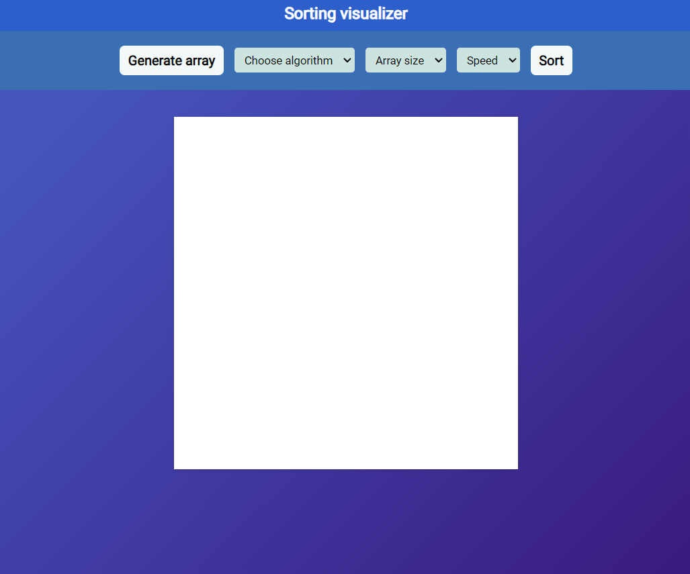

# Sorting Visualizer

## Description

This Sorting Visualizer is a web application built with vanilla JavaScript, HTML, and CSS. It allows you to visualize various sorting algorithms in action, including Bubble Sort, Insertion Sort, Merge Sort, Quick Sort, and Selection Sort. Additionally, you can generate a random array and adjust the visualization speed.

## Project Demo

Check out the live demo of the project [here](https://subham7201.github.io/sorting_visualizer/).

## Features

### Sorting Algorithms

- Bubble Sort
- Insertion Sort
- Merge Sort
- Quick Sort
- Selection Sort

### Array Generation

- Generate a random array for sorting visualization.

### Visualization Speed

- Adjust the speed of the visualization.

## Screenshots

## Usage

- Select a sorting algorithm from the dropdown menu.
- Adjust the array size using the corresponding dropdown menu.
- Adjust the speed of the visualization using the speed dropdown menu.
- Click the "Generate array" button to randomly generate an array for sorting visualization.
- Click the "Sort" button to start the visualization of the selected sorting algorithm.

